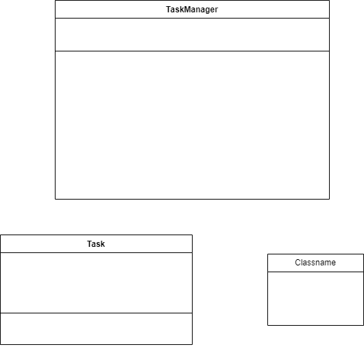

# **Екзаменаційна робота** 
## **За завданням №8**

___

Завдання 8.

Розробіть систему управління завданнями в офісі з наступним функціоналом:

· Кожне завдання має унікальний ідентифікатор, назву, опис та статус (наприклад, "в процесі", "завершено"). Потрібні методи для відображення інформації про завдання (у консоль або файл).

· Система повинна забезпечувати зберігання завдань у деякому сховищі та їх управління. Для цього необхідні методи для додавання, видалення, оновлення інформації про завдання за їх ідентифікатором, а також для отримання завдання з сховища даних за їх ідентифікатором та для пошуку завдань за статусом.

· Система повинна здійснювати взаємодію з завданнями, включаючи реалізацію таких операцій, як:

§ призначення завдання співробітникам;

§ оновлення статусу завдання;

§ перегляд списку завдань співробітника.

· Додайте можливість нагадувань про завдання. Система має надсилати сповіщення користувачам про наближення дедлайнів та не виконані завдання.
 
___

### **uml діаграма класів**

